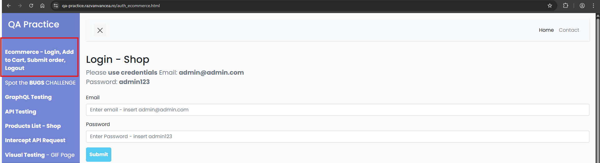
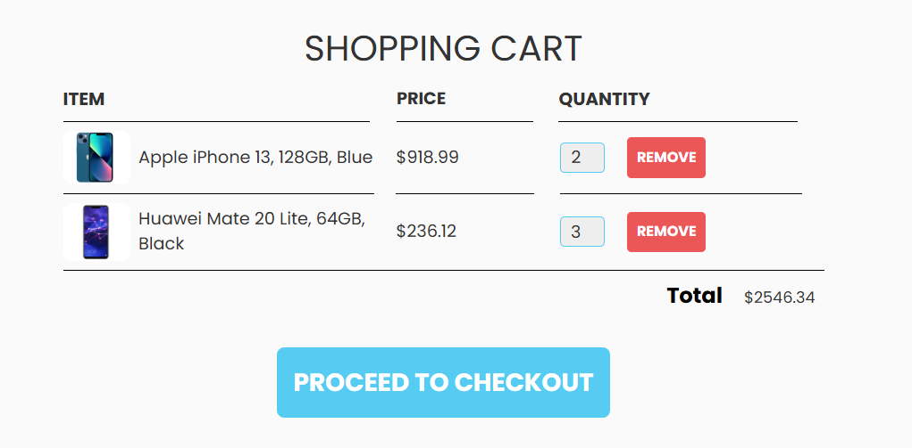
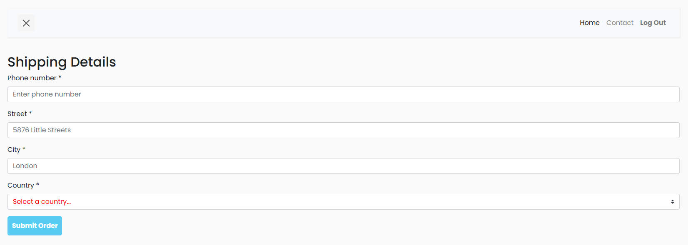
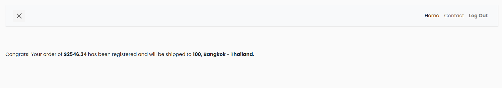
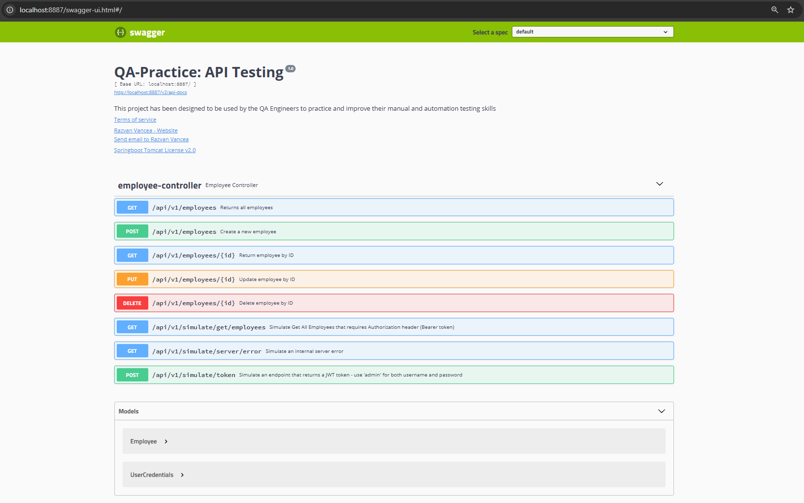

# Interview QA Test
## Prerequisite

- Create project by using <b>Cypress</b> or <b>Playwright</b> framework.
- Using a link https://qa-practice.razvanvancea.ro/auth_ecommerce.html to implement test frontend example by following questions.
- <b>Docker Desktop</b> to run container by execute the following CLI  
command `docker run -d --rm --name qa-practice-api -p8887:8081 rvancea/qa-practice-api:latest`
- After running docker using a link http://localhost:8887/swagger-ui.html#/ to implement test backend example by following questions.

## Questions UI Part

- Implement positive & negative test cases in <b>step1(Login - Shop)</b>

 

- Implement positive test cases in <b>step2</b> by following test cases as below:
  - Select Items correctly by following
    1. Apple iPhone 13, 128GB, Blue <b>2 units</b>.
    2. Huawei Mate 20 Lite, 64GB, Black <b>3 units</b>.      
  - Implement validate the <b>Total</b> cost test case by using price x quantity any of both items and summary result must be correctly.
  - Trigger Proceed to checkout button
  

 

- Implement positive & negative test cases in <b>step3(Shopping Details)</b> by following test cases as below:
  - Implement positive test cases input all required fields must be able to <b>Submit Order</b>
  - Implement negative test cases input all required fields must `not` be able to <b>Submit Order</b>
    

 

- Implement positive case in <b>step4</b> by following test cases as below:
  - Implement validate an address must be displayed correctly by concat between <b>Street, City - Country</b> format.
    

 

- Implement run overall step 1 to 4.

 

## Questions API Part

- Implement positive & negative case in `POST Method` and `/api/v1/employees Endpoint` by following test cases as below:
  - Implement positive test cases to ensure that success must be return response code `201`
  - Implement negative test cases to ensure that failed must be return response code `400` and validate `defaultMessage` when `email address` invalid format.
- Implement positive & negative case in `GET Method` and `/api/v1/employees/{id} Endpoint` by following test cases as below:
  - Implement positive test cases to ensure that id is existing will be return response code `200`
  - Implement negative test cases to ensure that id is `not` existing will be return response code `404` and validate response body message `Employee not found with ID {id}`.
    

 

- Explain the report result & code review on interview session.